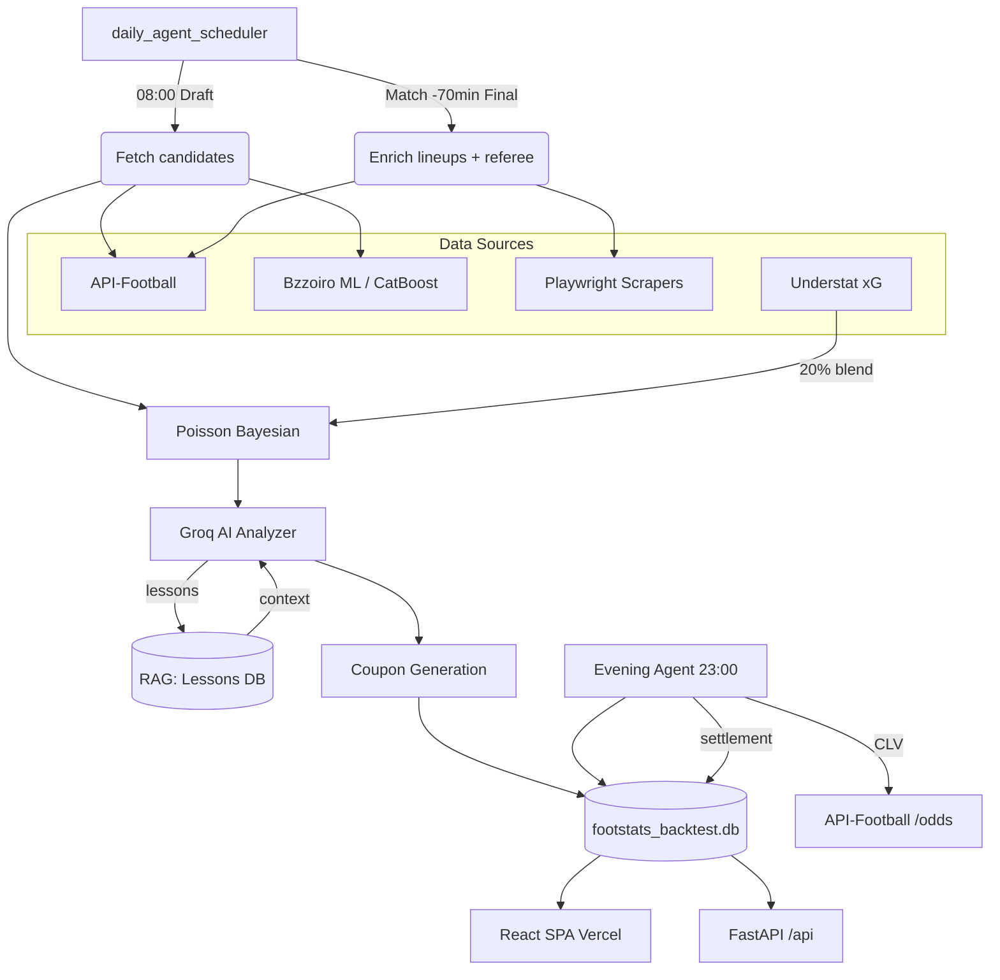

# ⚽ FootStats v3.4 — Autonomous AI Soccer Prediction Engine

[](https://www.python.org/)
[](LICENSE)
[](https://fastapi.tiangolo.com/)
[](https://react.dev/)
[](https://playwright.dev/)
[](tests/)

**🌐 English · [Polski](README.pl.md)**

**FootStats** is an autonomous soccer-betting prediction system combining Bayesian statistics (Poisson + Dixon-Coles), ML (CatBoost/Bzzoiro), xG analysis (Understat) and an LLM (Groq/Llama 3.1). It runs fully unattended: scraping → analysis → coupon generation → settlement → learning from mistakes. React/Vite frontend (Vercel), FastAPI backend (Cloud Run), Neon PostgreSQL database.

---

## 🚀 For Recruiters

> **TL;DR** — A production-grade, autonomous ML system for soccer prediction: Bayesian statistics
> (Poisson + Dixon-Coles) + ensemble + LLM, validated **walk-forward out-of-sample on 32,400 matches**.
> A full hands-off loop: scraping → prediction → coupon → settlement → learning from mistakes.

**🔗 Live demo:** [bot-opal-nu.vercel.app](https://bot-opal-nu.vercel.app)  ·  **API:** FastAPI @ Google Cloud Run  ·  **DB:** Neon PostgreSQL

### Why it's worth a look
- 🧪 **1,346 tests** with pytest + CI (lint · security · coverage gate) + a regression gate on broad excepts — quality is *enforced*, not claimed.
- 📊 **Scientific validation, not marketing** — walk-forward with no look-ahead, A/B of model variants, per-band calibration. Dixon-Coles **51.8%** out-of-sample; the market ceiling was deliberately measured (4 experiments, 3 rejected as dead ends — data-driven decisions).
- 🤖 **Full autonomy** — a daily pipeline (Windows Task Scheduler + Google Cloud Scheduler), PC-independent; prediction, settlement and RAG feedback with zero intervention.
- 🔒 **Production rigor** — OWASP API hardening (live), JWT multi-user, GDPR, DevSecOps in CI (bandit · gitleaks · pip-audit), feature-flagged rollouts (default-OFF, validated before flipping).
- 🧩 **Architecture** — multi-source scraping with cross-validation (4 sources), graceful degradation, idempotent writers, decomposition of god-modules.

Tech at a glance:

| Area | Implementation |
|------|----------------|
| **Autonomous Agents** | Draft→Final scheduler, Evening Agent (23:00), Operator Agent |
| **RAG Feedback Loop** | Groq analyzes lost coupons → vectors → context for the next prediction |
| **Feature Engineering** | Poisson + xG (attack × opponent defense) + home/away form + fatigue/rotation + injuries (both sides) + referee |
| **Bayesian Statistics** | Isotonic calibration + 1X2 renormalization, Poisson+ML ensemble (per-league weights), CLV tracking |
| **Advanced Scraping** | Playwright (Superbet, FlashScore, STS), requests (Understat, Bzzoiro, API-Football) |
| **Full-Stack** | FastAPI REST (Cloud Run) + React/Vite SPA (Vercel) + Neon PostgreSQL + multi-user (JWT) |
| **Quality** | 1,346 pytest tests, broad-except regression gate, CI (lint/security/coverage) + Docker health + daily DB backup (Neon pg_dump) |

---

## 🏗️ System Architecture



---

## 🛠️ Tech Stack

| Layer | Technology |
|-------|------------|
| **AI / ML** | Groq (Llama 3.1 70B/8B), CatBoost (Bzzoiro), Bayesian Poisson, Ensemble |
| **Feature Eng.** | xG (Understat), home/away form (`core/form.py`), fatigue (`core/fatigue.py`), injuries |
| **Scraping** | Playwright, requests + BS4, Understat JSON, API-Football v3 |
| **Backend** | FastAPI, Uvicorn, Neon PostgreSQL (prod) / SQLite (dev), Pydantic v2 |
| **Frontend** | React/Vite SPA (Vercel) — coupon builder, BetBuilder, markets catalog; Streamlit/Rich (dev/CLI) |
| **Tracking** | CLV (Closing Line Value), A/B accuracy tab, weekly per-league report |
| **Ops** | Windows Task Scheduler, Cloud Run (GCP), Docker, Sentry |

---

## 🌟 Key Features

### Prediction
- **Bayesian Poisson v2.6** — walk-forward bias calibration, 20% xG blend from Understat
- **Ensemble Model** — Poisson + Bzzoiro CatBoost, `roznica_modeli` (model disagreement) as a confidence feature
- **xG Integration** — Understat scraper (free), 6h cache, prefetch before the prediction loop
- **Feature Engineering** — home/away form, H2H "patent", fatigue, referee, injuries, pitch

### Risk Management
- **Kelly Criterion v2** — dynamic stakes based on bankroll and hit rate
- **Stop-Loss** — daily (−10% of bankroll) + streak detection (reduced stakes on 3+ in a row)
- **Value Bet Filter** — EV > 3%, Kelly > 1%, pre-filter before Groq (token savings)

### Automation
- **Draft Phase (08:00)** — candidates from Bzzoiro + API-Football Ekstraklasa, Poisson, Groq
- **Final Phase (match −70 min)** — lineups from API-Football, coupon decision, Telegram delivery
- **Evening Agent (23:00)** — settle ACTIVE coupons, CLV capture, auto-trainer after 20+ results
- **RAG Feedback Loop** — post-match AI analysis of losses → vectors → context

### Monitoring
- **CLV Tracking** — automatic capture of closing odds from API-Football after each match
- **A/B Dashboard** — accuracy comparison of variant A vs B
- **Weekly Report** — per-league performance, ROI, accuracy trend
- **Second Mind Graph** — vis-network visualization of the bot's knowledge (`brain_graph.html`)

---

## 📦 Project Structure

```plaintext
src/footstats/
├── ai/            # analyzer.py (Groq prompt), trainer.py, RAG, post_match_analyzer
├── core/          # poisson.py, backtest.py, bankroll.py, clv_tracker.py, form.py, fatigue.py
├── scrapers/      # bzzoiro.py, superbet.py, understat_xg.py, api_football.py, kursy.py …
├── api/           # FastAPI routes (coupons, predictions, bankroll, status)
├── utils/         # telegram_notify.py, db.py, normalize.py, cache.py
├── daily_agent.py         # main agent (1400 LOC)
├── evening_agent.py       # coupon settlement @ 23:00
├── daily_agent_scheduler.py
└── operator_agent.py      # smoke + pipeline + review orchestrator
tests/             # 1,346 pytest tests
scripts/           # preflight, backup_db, visualize_brain, run_operator.bat
data/              # footstats_backtest.db, model_calibration.json
cache/             # api_football/, understat_xg/, flashscore/, kursy/
```

---

## 🤖 Operator Agent

The orchestrator runs preflight → API smoke → `daily_agent` draft → Groq review.

```bash
python scripts/preflight_footstats.py
python -m footstats.operator_agent --only smoke
python -m footstats.operator_agent --faza full
python -m footstats.operator_agent --only review
```

Logs: `data/logs/operator_agent.log` | Reports: `data/operator_reports/`

---

## 🧪 Tests

```bash
pytest tests/ -v                          # 1,346 tests
pytest tests/test_poisson.py -v           # Bayesian Poisson + edge cases
pytest tests/test_clv_tracker.py -v       # CLV tracking
pytest tests/test_broad_except_audit.py   # regression gate: no new broad excepts
pytest tests/test_version_consistency.py  # pyproject.toml == config.VERSION
```

---

## 📊 Accuracy Status

| Milestone | Target | Status |
|-----------|--------|--------|
| **M0** | ~42% (baseline) | ✅ Current |
| **M1** | 55% overall | 🔄 In progress — offline model validated (Dixon-Coles 51.8% A/B, monotonic calibration 65%+ = 68%); the path is high-conf selection + collecting fresh settled results |
| **Offline (walk-forward)** | — | ✅ DC 51.8% > baseline 50.3% > poisson 48.8%; in prod since 06-19 (`USE_DIXON_COLES`) + market reweight 30/70 live (`ENSEMBLE_MARKET_WEIGHT=0.70`) |
| **Data collection** | — | ✅ PC-independent System paper-trading (Cloud Scheduler draft 07:30 + settle) → fresh validation data without a PC |
| **M2** | 60% overall | Bayesian ensemble + value filter |
| **M3** | 65% selected | Full xG + stop-loss + CLV gate |
| **M4** | 70% selected | 3-month track record |

---

## License

All Rights Reserved — the code is shared for portfolio/CV review only, with no right to copy,
redistribute, or use it in other projects. Details: [LICENSE](LICENSE).
