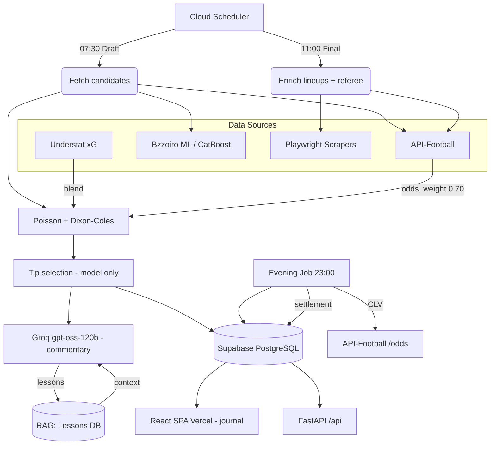

# ⚽ FootStats v3.4 — Soccer Prediction Engine + Betting Journal

[](https://www.python.org/)
[](LICENSE)
[](https://fastapi.tiangolo.com/)
[](https://react.dev/)
[](https://playwright.dev/)
[](tests/)

**🌐 English · [Polski](README.pl.md)**

**FootStats** is a soccer prediction engine wrapped around a **betting journal**. Bayesian statistics (Poisson + Dixon-Coles), an ML arm (CatBoost/Bzzoiro), market prices, and an LLM (Groq `openai/gpt-oss-120b`) that writes the commentary but — since 2026-07-06 — **never picks the tip**. The pipeline runs unattended on Cloud Run Jobs: scraping → prediction → settlement → learning from results. React/Vite frontend (Vercel), FastAPI backend (Cloud Run), Supabase PostgreSQL.

> **The headline result is negative, and this repo says so out loud.** Measured walk-forward on **120,351 matches**, the model does **not** beat closing odds in a **single one of 39 leagues** (2026-09-04). The model was therefore **frozen on 2026-09-10** — no new features, arms, or λ corrections. What ships is the **journal**: people log their own coupons and track their own progress.

---

## 🚀 For Recruiters

> **TL;DR** — A production-grade, fully autonomous ML system: Bayesian statistics (Poisson + Dixon-Coles) + market ensemble + LLM commentary, validated walk-forward out-of-sample on six-figure match counts — **including the experiments that failed**. The interesting engineering is in the measurement discipline and the post-mortems, not in a win-rate claim.

**🔗 Live demo:** [bot-opal-nu.vercel.app](https://bot-opal-nu.vercel.app)  ·  **API:** FastAPI @ Google Cloud Run  ·  **DB:** Supabase PostgreSQL

### Why it's worth a look
- 🧪 **6,711 pytest tests** + CI (lint · mypy · bandit · pip-audit · gitleaks · coverage gate) + a regression gate on broad excepts — quality is *enforced*, not claimed.
- 📊 **Negative results are published, not buried** — "does the model beat the market" is answered **no**, with n, z-scores and the holdout that killed 52 candidate subsets. Several promising signals (BTTS two-way, shots-on-target, xG on top of shots) were measured, failed replication, and were written down as failures.
- 🤖 **Full autonomy** — a daily pipeline on Google Cloud Run Jobs + Cloud Scheduler, fully PC-independent: prediction, settlement, CLV capture and RAG feedback with zero intervention.
- 🔒 **Production rigor** — OWASP API hardening (live), JWT multi-user, GDPR/18+ gating, DevSecOps in CI, feature-flagged rollouts (default-OFF, validated before flipping), guard hooks that block local runs from touching the production DB.
- 🩺 **Failure archaeology** — recurring production bugs are root-caused and documented rather than patched at the call site (e.g. the same `NoneType` crash in five consumers → fixed once at the source).

Tech at a glance:

| Area | Implementation |
|------|----------------|
| **Autonomous Agents** | Cloud Scheduler draft (07:30 CEST) → Cloud Run Job `footstats-final` (11:00) → `footstats-evening` (23:00) + settle 06:00 / 21:30 UTC |
| **RAG Feedback Loop** | Groq analyzes settled coupons (wins as well as losses) → lessons → context for the next prediction; chronological retrieval, semantic search deliberately OFF in prod |
| **Feature Engineering** | Poisson + xG (attack × opponent defense) + home/away form + fatigue/rotation + injuries (both sides) + referee + shots on target |
| **Bayesian Statistics** | Dixon-Coles τ, per-league λ estimation, isotonic calibration + 1X2 renormalization, model/market ensemble at 30/70, CLV tracking |
| **Advanced Scraping** | Playwright (Superbet, FlashScore, STS), requests (Understat, Bzzoiro, API-Football, football-data.co.uk, FotMob) |
| **Full-Stack** | FastAPI REST (Cloud Run) + React/Vite SPA (Vercel) + Supabase PostgreSQL + multi-user (JWT) |
| **Quality** | 6,711 pytest tests, broad-except regression gate, CI (lint/security/coverage) + Docker health + daily DB backup (pg_dump → GCS) |

---

## 🏗️ System Architecture


```mermaid
graph TD
    A[Cloud Scheduler] -->|07:30 Draft| B(Fetch candidates)
    A -->|11:00 Final| C(Enrich lineups + referee)

    subgraph "Data Sources"
        D[API-Football]
        E[Bzzoiro ML / CatBoost]
        F[Playwright Scrapers]
        G[Understat xG]
    end

    B --> D & E
    C --> F & D

    B --> H[Poisson + Dixon-Coles]
    G -->|blend| H
    D -->|odds, weight 0.70| H
    H --> K[Tip selection - model only]
    K --> I[Groq gpt-oss-120b - commentary]

    I -->|lessons| J[(RAG: Lessons DB)]
    J -->|context| I

    K --> L[(Supabase PostgreSQL)]
    L --> M[React SPA Vercel - journal]
    L --> N[FastAPI /api]

    O[Evening Job 23:00] --> L
    O -->|CLV| P[API-Football /odds]
    O -->|settlement| L
```

---

## 🛠️ Tech Stack

| Layer | Technology |
|-------|------------|
| **AI / ML** | Groq `openai/gpt-oss-120b` (commentary only — never picks), CatBoost (Bzzoiro), Bayesian Poisson + Dixon-Coles, model/market ensemble |
| **Feature Eng.** | xG (Understat), home/away form (`core/form.py`), fatigue (`core/fatigue.py`), injuries + lineups (FotMob), shots on target |
| **Scraping** | Playwright, requests + BS4, Understat JSON, API-Football v3, football-data.co.uk |
| **Backend** | FastAPI, Uvicorn, Supabase PostgreSQL (prod) / SQLite (dev), Pydantic v2 |
| **Frontend** | React/Vite SPA (Vercel) — coupon journal, coupon builder, BetBuilder, markets catalog; Streamlit/Rich (dev/CLI) |
| **Data** | 140,919-match parquet history (through 2026-09-17), refreshed weekly by a GitHub Action that opens a PR |
| **Tracking** | CLV (Closing Line Value), per-market calibration, weekly per-league report |
| **Ops** | Cloud Run Jobs + Cloud Scheduler (GCP), Docker, Sentry |

---

## 🌟 Key Features

### Betting journal (the product)
- **Own-coupon log** — users record what they actually played (including paper coupons), with the bookmaker as a plain data field
- **Progress tracking** — ROI, win rate, streaks (`core/user_stats.py`), progress chart, opt-in leaderboard
- **Auto-settlement** — coupons are linked to real fixtures (`core/match_linker.py`, strict exact matching) and settled from multiple result sources
- **No money flows through the system** — units, not currency; no affiliate links, no betting incentives

### Prediction (frozen 2026-09-10)
- **Poisson + Dixon-Coles** — per-league λ estimation (90-day window with decay + shrinkage), τ correlation correction
- **Ensemble** — model blended toward the market at 30/70 (`ENSEMBLE_MARKET_WEIGHT=0.70`); the market arm dominates because it measurably wins
- **LLM is not a picker** — Groq writes analysis and summaries; tip selection is the model's (fixed 2026-07-06 after an audit showed the LLM was destroying +12pp of 1X2 accuracy)
- **Feature Engineering** — home/away form, H2H patterns, fatigue, referee, injuries, pitch, shots on target

### Automation
- **Draft (07:30 CEST, Cloud Scheduler)** — candidates from Bzzoiro + API-Football, Poisson, LLM commentary
- **Final (11:00, Cloud Run Job)** — lineups from API-Football, coupon decision, Telegram delivery
- **Evening (23:00)** — settle ACTIVE coupons, CLV capture, auto-trainer after 20+ results
- **Settlement backstops** — 06:00 / 21:30 UTC settle runs, `core/clv_zalegle` back-fills CLV once late CSV sources catch up

### Monitoring
- **Quality alarms** (`core/alarmy_jakosci`) — end-of-run correctness checks, the project's preferred alternative to yet another unit test
- **CLV Tracking** — closing odds captured after each match
- **Weekly Report** — per-league performance, ROI, accuracy trend
- **Second Mind Graph** — vis-network visualization of the bot's knowledge (`brain_graph.html`)

---

## 📦 Project Structure

```plaintext
src/footstats/
├── ai/            # analyzer.py (Groq prompt), client.py, trainer.py, RAG, post_match_analyzer
├── core/          # poisson.py, backtest.py, bankroll.py, clv_tracker.py, form.py, fatigue.py,
│                  # match_linker.py, user_stats.py, alarmy_jakosci/
├── scrapers/      # bzzoiro.py, superbet.py, understat_xg.py, api_football.py, kursy.py,
│                  # sources/ (multi-source results + cross-validation)
├── api/           # FastAPI routes (auth, coupons, predictions, analyses, cron, status)
├── db/            # migrations.py, schema
├── gui/           # React/Vite SPA (Vercel)
├── utils/         # telegram_notify.py, db.py, normalize.py, cache.py, mailer.py
├── daily_agent.py         # main agent (1,358 LOC) + _decision / _output / _scheduler
├── evening_agent.py       # coupon settlement @ 23:00
└── operator_agent.py      # smoke + pipeline + review orchestrator
tests/             # 6,711 pytest tests
scripts/           # preflight, backup_db, visualize_brain, calibration_monitor
data/              # parquet history (140,919 matches), model_calibration.json, legacy SQLite
cache/             # api_football/, understat_xg/, flashscore/, kursy/
docs/              # extended docs (cloud_migration.md, blueprints/) + archive/ + screenshots/
```

---

## 🤖 Operator Agent

The orchestrator runs preflight → API smoke → `daily_agent` draft → Groq review.

```bash
python scripts/preflight_footstats.py
python -m footstats.operator_agent --only smoke
python -m footstats.operator_agent --faza full
python -m footstats.operator_agent --only review
```

Logs: `data/logs/operator_agent.log` | Reports: `data/operator_reports/`

---

## 🧪 Tests

```bash
DATABASE_URL="" pytest tests/ -v          # 6,711 tests (empty URL = unit suite, never prod)
pytest tests/test_poisson.py -v           # Bayesian Poisson + Dixon-Coles edge cases
pytest tests/test_clv_tracker.py -v       # CLV tracking
pytest tests/test_broad_except_audit.py   # regression gate: no new broad excepts
pytest tests/test_version_consistency.py  # pyproject.toml == config.VERSION
```

A guard refuses to run the suite against a known production database — tests write rows, and that
lesson was learned the hard way.

---

## 📊 What has actually been measured

No targets, no roadmap percentages — only findings, each with its sample size.

| Question | Answer | Evidence |
|----------|--------|----------|
| **Does the model beat the market?** | ❌ **No** | n=120,351, **39 of 39 leagues negative** (2026-09-04). An earlier "lazy market" hypothesis was reversed at z=−3.78 |
| **Is the model calibrated?** | ✅ Yes | n=424: no bias on any of 5 outputs (\|z\|<1.3), ECE 0.029–0.037. Fitting a calibrator makes out-of-sample NLL *worse* — there is nothing to calibrate |
| **Where is the ceiling?** | Resolution, not calibration | Shots on target improve Brier by +0.0043 (z=2.93, n=3,568) but **did not replicate** on 6 fresh leagues (z=+0.89); xG adds nothing on top of shots (z=−0.15) |
| **Live vs offline** | Indistinguishable | `model_log`: poisson-dc vs bzzoiro-ml confidence intervals overlap; Poisson scores a minority of matches |
| **Line movement** | One real signal | The model predicts the *direction* of Pinnacle line movement (31% of achievable, survived a placebo control) — yet gives zero edge in tipping |
| **Settlement coverage** | 90% | 124 of 138 predictions settled over 60 days; the gap is leagues with no result source (Brasileirão Série B 0/6, USL 3/6) |
| **Dataset** | 140,919 matches | Through 2026-09-17, refreshed weekly, verified for per-league and per-value losses on every refresh |

**Model status: FROZEN (2026-09-10).** Bug fixes, measurement and monitoring only — no new features,
arms, λ corrections or prediction sources. Predictions are not displayed in the GUI outside the
coupon builder.

---

## License

All Rights Reserved — the code is shared for portfolio/CV review only, with no right to copy,
redistribute, or use it in other projects. Details: [LICENSE](LICENSE).
