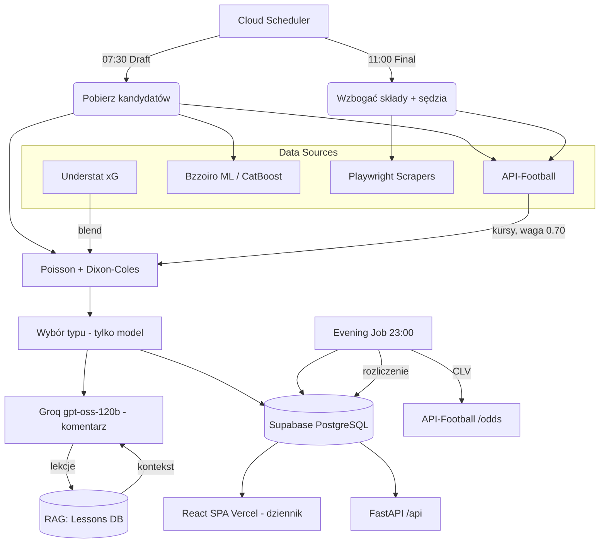

# ⚽ FootStats v3.4 — silnik predykcji piłkarskiej + dziennik kuponów

[](https://www.python.org/)
[](LICENSE)
[](https://fastapi.tiangolo.com/)
[](https://react.dev/)
[](https://playwright.dev/)
[](tests/)

**🌐 [English](README.md) · Polski**

**FootStats** to silnik predykcji piłkarskiej zbudowany wokół **dziennika kuponów**. Statystyka Bayesowska (Poisson + Dixon-Coles), ramię ML (CatBoost/Bzzoiro), ceny rynkowe oraz LLM (Groq `openai/gpt-oss-120b`), który pisze komentarz, ale — od 2026-07-06 — **nie wybiera typu**. Pipeline chodzi bezobsługowo na Cloud Run Jobs: scraping → predykcja → rozliczenie → nauka na wynikach. Frontend React/Vite (Vercel), backend FastAPI (Cloud Run), DB Supabase PostgreSQL.

> **Główny wynik jest negatywny i repo mówi to wprost.** Zmierzone walk-forward na **120 351 meczach**: model **nie bije** kursów zamknięcia w **żadnej z 39 lig** (2026-09-04). Dlatego model został **zamrożony 2026-09-10** — zero nowych cech, ramion i korekt λ. Produktem jest **dziennik**: ludzie zapisują własne kupony i śledzą własny postęp.

---

## 🚀 Dla Rekrutera

> **TL;DR** — Produkcyjny, w pełni autonomiczny system ML: statystyka Bayesowska (Poisson + Dixon-Coles) + ensemble z rynkiem + komentarz LLM, walidowany walk-forward out-of-sample na sześciocyfrowych próbach — **łącznie z eksperymentami, które padły**. Ciekawa inżynieria siedzi w dyscyplinie pomiaru i w post-mortemach, nie w deklarowanym win-rate.

**🔗 Live demo:** [bot-opal-nu.vercel.app](https://bot-opal-nu.vercel.app)  ·  **API:** FastAPI @ Google Cloud Run  ·  **DB:** Supabase PostgreSQL

### Dlaczego warto zerknąć
- 🧪 **6711 testów pytest** + CI (lint · mypy · bandit · pip-audit · gitleaks · coverage gate) + regression gate na broad-except — jakość *wymuszana*, nie deklarowana.
- 📊 **Wyniki negatywne publikowane, nie chowane** — na pytanie „czy model bije rynek" odpowiedź brzmi **nie**, z n, z-score'ami i holdoutem, który zabił 52 kandydujące podzbiory. Kilka obiecujących sygnałów (BTTS dwustronne, strzały celne, xG ponad strzałami) zostało zmierzonych, nie przeszło replikacji i zostało zapisane jako porażki.
- 🤖 **Pełna autonomia** — dzienny pipeline na Google Cloud Run Jobs + Cloud Scheduler, w pełni PC-niezależny: predykcja, rozliczenie, CLV i RAG-feedback bez interwencji.
- 🔒 **Rygor produkcyjny** — OWASP API hardening (live), JWT multi-user, RODO + bramka 18+, DevSecOps w CI, rollouty za flagami (default-OFF, walidowane przed flipem), guard-hooki blokujące lokalne odpalenia przeciw produkcyjnej bazie.
- 🩺 **Archeologia awarii** — powtarzające się bugi produkcyjne są root-cause'owane, nie łatane w miejscu wywołania (np. ten sam crash `NoneType` w pięciu konsumentach → naprawiony raz, u źródła).

Stos technik zwięźle:

| Obszar | Implementacja |
|--------|--------------|
| **Autonomous Agents** | Cloud Scheduler draft (07:30 CEST) → Cloud Run Job `footstats-final` (11:00) → `footstats-evening` (23:00) + settle 06:00 / 21:30 UTC |
| **RAG Feedback Loop** | Groq analizuje rozliczone kupony (trafione tak samo jak nietrafione) → lekcje → kontekst następnej predykcji; wyszukiwanie chronologiczne, semantyczne świadomie OFF na prod |
| **Feature Engineering** | Poisson + xG (atak × obrona rywala) + forma H/A + zmęczenie/rotacja + kontuzje (dwustronne) + sędzia + strzały celne |
| **Bayesian Statistics** | τ Dixona-Colesa, estymacja λ per liga, kalibracja izotoniczna + renorm 1X2, ensemble model/rynek 30/70, CLV tracking |
| **Advanced Scraping** | Playwright (Superbet, FlashScore, STS), requests (Understat, Bzzoiro, API-Football, football-data.co.uk, FotMob) |
| **Full-Stack** | FastAPI REST (Cloud Run) + React/Vite SPA (Vercel) + Supabase PostgreSQL + multi-user (JWT) |
| **Quality** | 6711 testów pytest, regression gate na broad-except, CI (lint/security/coverage) + Docker health + daily DB backup (pg_dump → GCS) |

---

## 🏗️ Architektura Systemu



---

## 🛠️ Tech Stack

| Warstwa | Technologia |
|---------|-------------|
| **AI / ML** | Groq `openai/gpt-oss-120b` (tylko komentarz — nigdy typ), CatBoost (Bzzoiro), Poisson Bayesian + Dixon-Coles, ensemble model/rynek |
| **Feature Eng.** | xG (Understat), forma H/A (`core/form.py`), zmęczenie (`core/fatigue.py`), kontuzje + składy (FotMob), strzały celne |
| **Scraping** | Playwright, requests + BS4, Understat JSON, API-Football v3, football-data.co.uk |
| **Backend** | FastAPI, Uvicorn, Supabase PostgreSQL (prod) / SQLite (dev), Pydantic v2 |
| **Frontend** | React/Vite SPA (Vercel) — dziennik kuponów, kreator kuponu, BetBuilder, katalog rynków; Streamlit/Rich (dev/CLI) |
| **Dane** | parquet z historią 140 919 meczów (do 2026-09-17), odświeżany co tydzień przez GitHub Action otwierający PR |
| **Tracking** | CLV (Closing Line Value), kalibracja per rynek, tygodniowy raport per liga |
| **Ops** | Cloud Run Jobs + Cloud Scheduler (GCP), Docker, Sentry |

---

## 🌟 Główne Funkcje

### Dziennik kuponów (produkt)
- **Zapis własnych kuponów** — użytkownik notuje to, co faktycznie zagrał (także kupony papierowe), bukmacher jest zwykłym polem danych
- **Śledzenie postępu** — ROI, win-rate, serie (`core/user_stats.py`), krzywa postępu, leaderboard na opt-in
- **Auto-rozliczenie** — kupony linkowane do realnych meczów (`core/match_linker.py`, dopasowanie ścisłe) i rozliczane z wielu źródeł wyników
- **Zero przepływu pieniędzy** — jednostki, nie waluta; bez linków afiliacyjnych i bez zachęt do gry

### Predykcja (zamrożona 2026-09-10)
- **Poisson + Dixon-Coles** — estymacja λ per liga (okno 90 dni z zanikiem + ściąganie), korekta korelacji τ
- **Ensemble** — model mieszany z rynkiem 30/70 (`ENSEMBLE_MARKET_WEIGHT=0.70`); ramię rynkowe dominuje, bo mierzalnie wygrywa
- **LLM nie typuje** — Groq pisze analizy i podsumowania; typ wybiera model (naprawione 2026-07-06, gdy audyt pokazał, że LLM kasował +12pp skuteczności 1X2)
- **Feature Engineering** — forma domowa/wyjazdowa, wzorce H2H, zmęczenie, sędzia, kontuzje, murawa, strzały celne

### Automatyzacja
- **Draft (07:30 CEST, Cloud Scheduler)** — kandydaci z Bzzoiro + API-Football, Poisson, komentarz LLM
- **Final (11:00, Cloud Run Job)** — składy z API-Football, decyzja kuponu, wysyłka Telegram
- **Evening (23:00)** — rozliczenie ACTIVE kuponów, CLV capture, auto-trainer po 20+ wynikach
- **Zabezpieczenia rozliczeń** — przebiegi settle 06:00 / 21:30 UTC, `core/clv_zalegle` dociąga CLV, gdy spóźnione źródła CSV wreszcie dojdą

### Monitoring
- **Alarmy jakości** (`core/alarmy_jakosci`) — kontrole poprawności na końcu przebiegu; w tym projekcie preferowane zamiast kolejnego testu jednostkowego
- **CLV Tracking** — zapis kursów zamknięcia po każdym meczu
- **Weekly Report** — skuteczność per liga, ROI, trend accuracy
- **Second Mind Graph** — wizualizacja wiedzy bota w vis-network (`brain_graph.html`)

---

## 📦 Struktura Projektu

```plaintext
src/footstats/
├── ai/            # analyzer.py (prompt Groqa), client.py, trainer.py, RAG, post_match_analyzer
├── core/          # poisson.py, backtest.py, bankroll.py, clv_tracker.py, form.py, fatigue.py,
│                  # match_linker.py, user_stats.py, alarmy_jakosci/
├── scrapers/      # bzzoiro.py, superbet.py, understat_xg.py, api_football.py, kursy.py,
│                  # sources/ (multi-source wyniki + cross-walidacja)
├── api/           # routes FastAPI (auth, coupons, predictions, analyses, cron, status)
├── db/            # migrations.py, schema
├── gui/           # React/Vite SPA (Vercel)
├── utils/         # telegram_notify.py, db.py, normalize.py, cache.py, mailer.py
├── daily_agent.py         # główny agent (1358 LOC) + _decision / _output / _scheduler
├── evening_agent.py       # rozliczanie kuponów @ 23:00
└── operator_agent.py      # smoke + pipeline + review orchestrator
tests/             # 6711 testów pytest
scripts/           # preflight, backup_db, visualize_brain, calibration_monitor
data/              # parquet z historią (140 919 meczów), model_calibration.json, legacy SQLite
cache/             # api_football/, understat_xg/, flashscore/, kursy/
docs/              # dokumentacja (cloud_migration.md, blueprints/) + archive/ + screenshots/
```

---

## 🤖 Operator Agent

Orchestrator uruchamia preflight → smoke API → `daily_agent` draft → review Groq.

```bash
python scripts/preflight_footstats.py
python -m footstats.operator_agent --only smoke
python -m footstats.operator_agent --faza full
python -m footstats.operator_agent --only review
```

Logi: `data/logs/operator_agent.log` | Raporty: `data/operator_reports/`

---

## 🧪 Testy

```bash
DATABASE_URL="" pytest tests/ -v          # 6711 testów (pusty URL = suita unit, nigdy prod)
pytest tests/test_poisson.py -v           # Poisson Bayesian + Dixon-Coles, przypadki brzegowe
pytest tests/test_clv_tracker.py -v       # CLV tracking
pytest tests/test_broad_except_audit.py   # regression gate: brak nowych broad except
pytest tests/test_version_consistency.py  # pyproject.toml == config.VERSION
```

Guard odmawia odpalenia suity przeciw znanej bazie produkcyjnej — testy zapisują wiersze,
a ta lekcja została odrobiona na twardo.

---

## 📊 Co faktycznie zmierzone

Bez celów i procentów z roadmapy — tylko wyniki, każdy z rozmiarem próby.

| Pytanie | Odpowiedź | Dowód |
|---------|-----------|-------|
| **Czy model bije rynek?** | ❌ **Nie** | n=120 351, **39 lig na 39 ujemne** (2026-09-04). Wcześniejsza hipoteza o „leniwym rynku" odwrócona przy z=−3,78 |
| **Czy model jest skalibrowany?** | ✅ Tak | n=424: zero obciążenia na 5 wyjściach (\|z\|<1,3), ECE 0,029–0,037. Dopasowanie kalibratora *pogarsza* NLL out-of-sample — nie ma czego kalibrować |
| **Gdzie jest sufit?** | Rozdzielczość, nie kalibracja | Strzały celne poprawiają Brier o +0,0043 (z=2,93, n=3568), ale **nie zreplikowały się** na 6 nowych ligach (z=+0,89); xG nie dokłada nic ponad strzały (z=−0,15) |
| **Live vs offline** | Nie do odróżnienia | `model_log`: przedziały ufności poisson-dc i bzzoiro-ml nachodzą na siebie; Poisson ocenia mniejszość meczów |
| **Ruch linii** | Jeden realny sygnał | Model przewiduje *kierunek* ruchu linii Pinnacle (31% osiągalnego, przeżył kontrolę placebo) — ale nie daje przewagi w typowaniu |
| **Pokrycie rozliczeń** | 90% | 124 ze 138 predykcji rozliczonych przez 60 dni; strata to ligi bez źródła wyników (Brasileirão Série B 0/6, USL 3/6) |
| **Zbiór danych** | 140 919 meczów | Do 2026-09-17, odświeżany co tydzień, przy każdym odświeżeniu sprawdzany pod kątem strat per liga i per wartość |

**Status modelu: ZAMROŻONY (2026-09-10).** Wolno wyłącznie naprawy błędów, pomiary i monitoring —
żadnych nowych cech, ramion, korekt λ ani źródeł predykcji. Predykcje nie pokazują się w GUI poza
kreatorem kuponu.

---

## Licencja

All Rights Reserved — kod udostępniony do przeglądu portfolio/CV, bez prawa kopiowania,
redystrybucji ani użycia w innych projektach. Szczegóły: [LICENSE](LICENSE).
